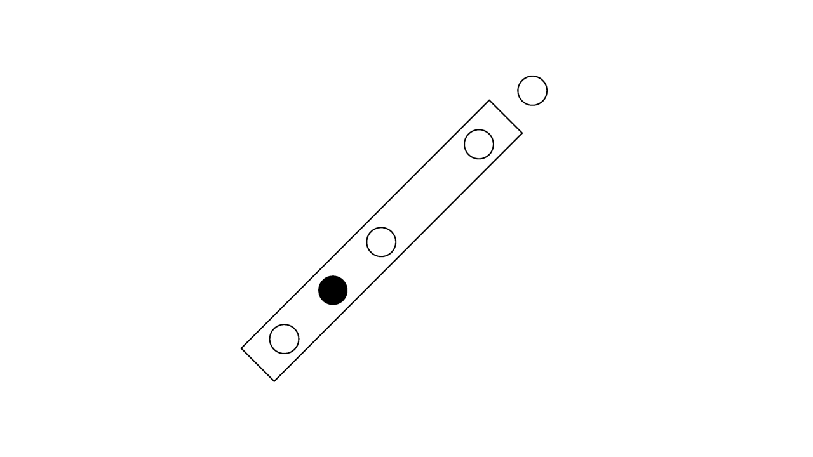

# Drawing 101

***Draw a picture by following a few simple instructions.
Keep the reference picture hidden throughout the drawing process.
Compare your results with the provided reference picture when you're done.***
*Play fair and have fun!*

**Instructions:**
1. **Step 1:** Draw a rectangle with a ratio of 1:7 (width:length) rotated at a 45-degree angle starting from the bottom left going upwards to the right.
2. **Step 2:** Draw 3 circles inside of the rectangle. One of the circles should be directly in the middle of the rectangle, the other two on each end of the rectangle. *(All of these circles should be aligned in an imaginary line going through the middle of the rectangle.)*
3. **Step 3:** Halfway between the bottom 2 circles, draw one more circle and fill it in.
4. **Step 3:** Use the imaginary line mentioned in Step 2 and use it to draw the last circle outside of the rectangle. The last circle should be outside the rectangle, near the top right corner. Don't forget to place it in line with the other circles.
5. **Recap:** The result should look something like a flute. One rectangle, 4 circles inside the rectangle, 1 outside the rectangle, and one of the circles filled in. All of the circles should be the same size and centrally aligned in one imaginary line. None of the circles shoud touch the rectangle.

***When you're done, compare your results with the reference picture below:***

