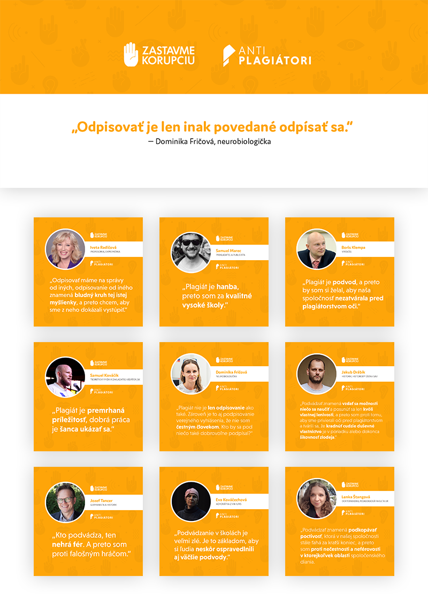
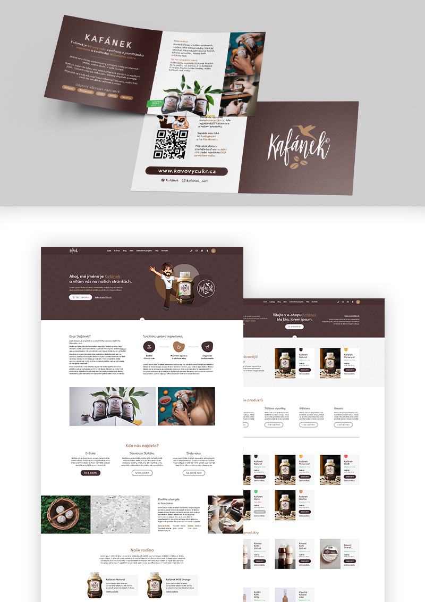
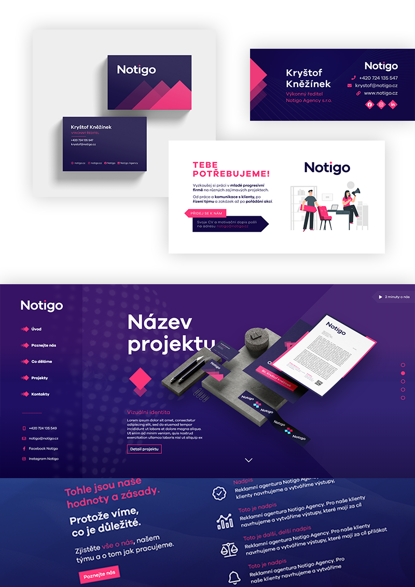

# Jakub Kula - Impression

---

## AntiPlagiátori

A community-driven antiplagiarism campaign  
Lean more on [www.antiplagiatori.sk](https://www.antiplagiatori.sk)

 
 

## Kafánek

Redesign, visual identity management, webdesign & packaging for a new coffe product.  
Feel free to browse through the newest interactive [website prototype.](https://xd.adobe.com/view/4994c612-692e-4aec-8ab3-58c83ca96af1-1cc7/?fullscreen)

 
 

## Notigo

Visual identity management and webdesign for an advertising agency.  
Take a look at the in-progress [website prototype.](https://xd.adobe.com/view/b914b2cc-df71-420d-91a1-51f79c2dc039-ec47/)

