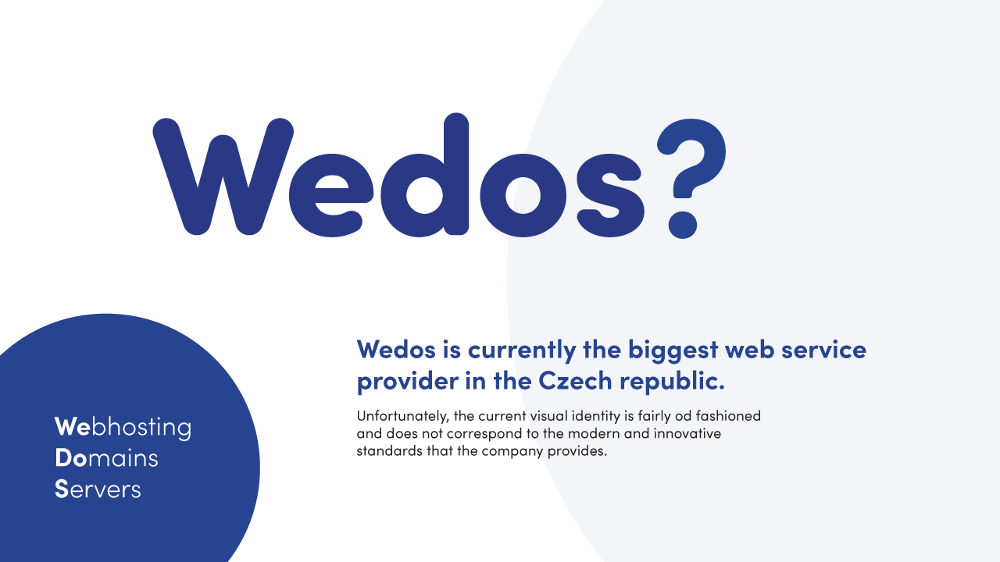
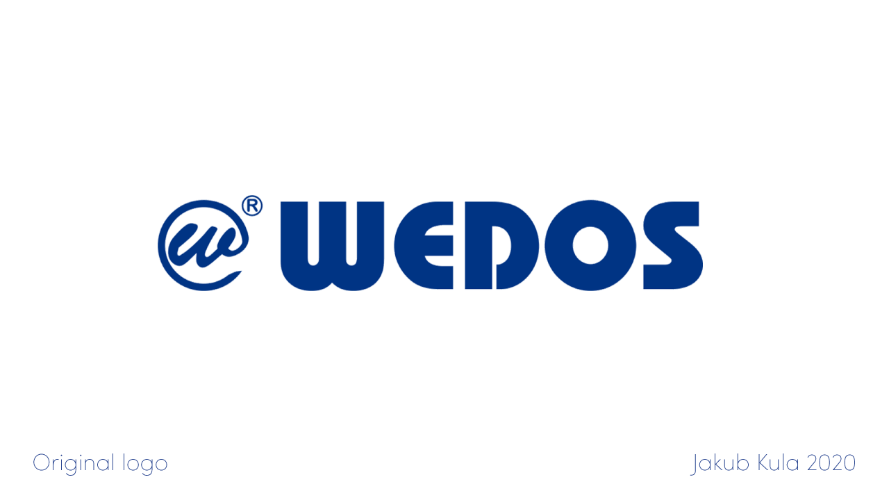
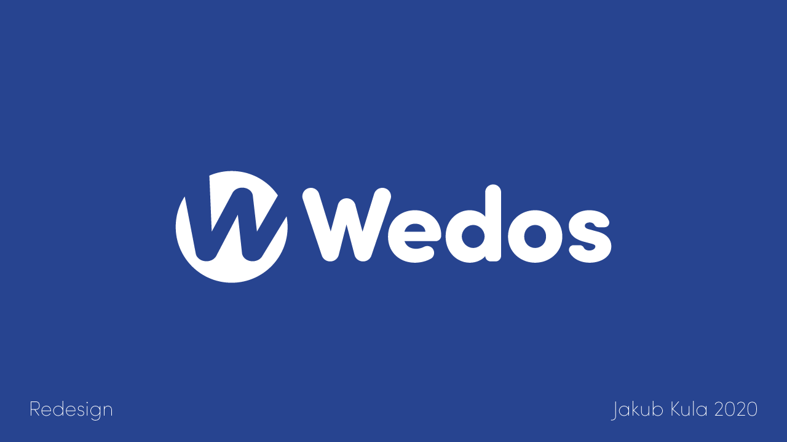
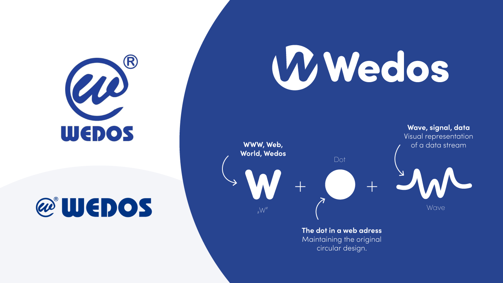
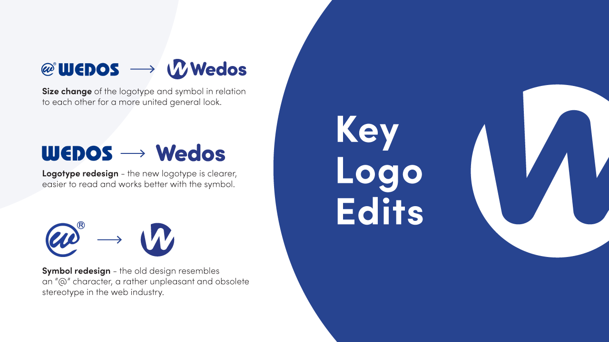
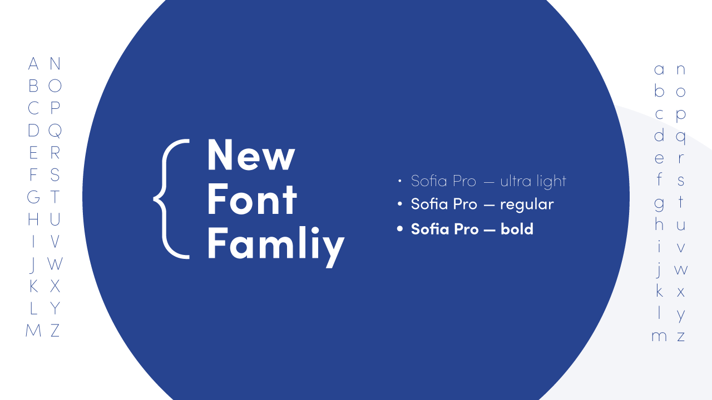
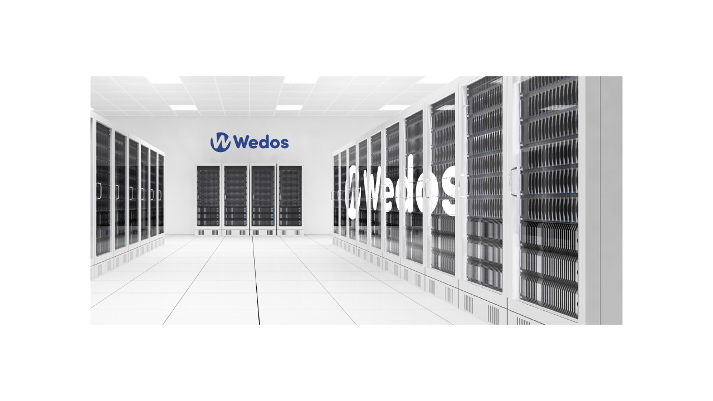
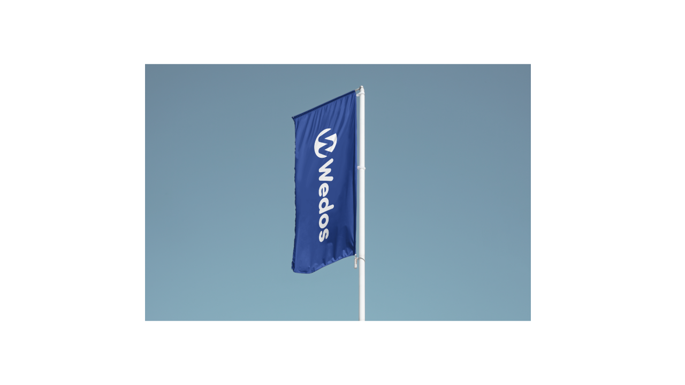

# Wedos Logo Redesign

---

## **Project background** 
This design project started as a school assignment to redesign a logo of a company. I chose to redesign Wedos - a leading web services company. I’ve had a good previous experience with their services but at first glance, their logo didn’t seem to fit into the visual identity. I couldn’t resist the urge to try and redesign the logo. 

---

## **Original vs. redesign** 
The original logo is, unfortunately, a little old-fashioned and does not follow the overall visual identity of the company. They've changed their website, UI, UX, and visual presentation multiple times without a single change to the logo since its creation. My main focus during the redesign was to adapt the logo to the current modern visual identity. 

  
  

---

## **Deconstructing the logo** 
Redesigning a logo like this came with a few challenges. The main task when redesigning was to make sure that the new logo kept all the fundamental meanings, ideas, and the main message as close to the original as possible. The second challenge was to redesign the logo in a way that it would still be recognizable and visually similar to the original. Keeping the format, colors, and the overall look and feel intact.

---

## **Main changes** 
There were a few major changes to the logo. The first one was redesigning the symbol as explained in the previous picture. Secondly, there was a change in the logotype. The Wedos title has been replaced with a brand new logotype based on the Sofia Pro typeface and customized to fit into the general rounded style which originated within the symbol. The last major change was the distribution of space and size of the logotype and symbol in relation to each other. The resulting logo is thereby clearer and easier to read with a balanced distribution of stroke weights. 

*Key changes:*

*Font family:*

*Design in action:*

