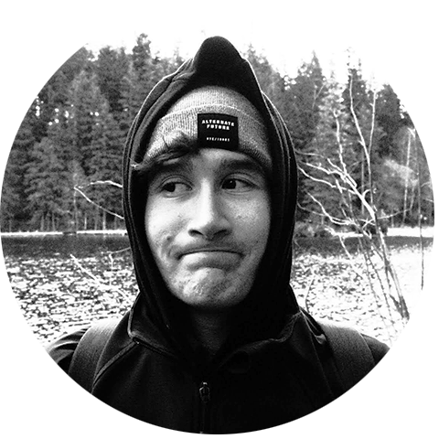

# Jakub Kula

## About Me

Hi! I'm Jakub Kula and I see design as an important contribution to society.   I’m a designer mainly focused on advertising and logo design.

**Check out some of my previous work:**  
[Wedos Redesign Case Study](case-study.md)

## My Story

I would describe myself as a designer with an unordinary attention to detail.   I aim to see things and think about things that are not visible at first glance.

For me, design is supposed to be beautiful, visually pleasing, easy to grasp   and while maintaining all these attributes, it still must fulfill its original purpose.

Throughout the years, I’ve gained most of my experience working on projects   that posed a challenge of some sort because problem solving and critical   thinking represent a significant part of the learning process when it comes to design.

In the outside world, I enjoy photography, going out into the wild,   exploring new places and spending time with people that matter.
