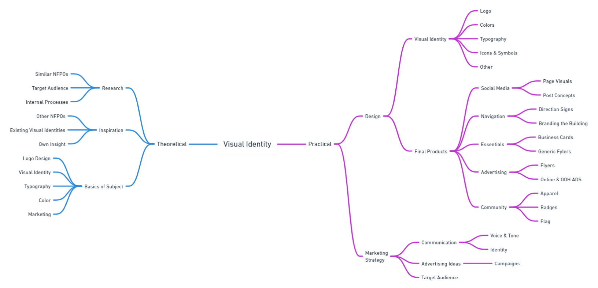

- [Summary](#Summary)
- [Mind Map](#mind-map)
- [Keywords](#keywords)
- [Key Points](#key-points)

# Visual Identity of a Non-Profit Organization
---
## Summary
The aim of my thesis is to create a functional and effective visual identity for a non-profit organization called Vydra. My thesis also focuses on analyzing the market of non-profit organizations.
My main goal is to create a visual identity that corresponds with the values and interests ​​of the organization. My intentions are to create an effective visual identity alongside with a basic marketing strategy.

  
<b>Mind Map</b>

  

## Keywords
- Graphic Design
- Non-Profit
- Visual Identity
- Branding
- Logo
- Marketing
- Communication
- Style
- Social Media
- Advertisement

## Key Points

<!-- Key points; aim for **30–60 words** each. -->
1. Background/importance of the topic:  I chose this topic because, when it comes to design, I have an inclination towards visual identities. Also, designing a visual identity provides for a wide range of creative opportunities. Choice of the subject was a simple process since I have been a volunteer of Vydra since 2015.

2. Purpose/hypothesis (thesis or statement of the problem):  The main purpose of my thesis is to create a design that works. The current visual identity of Vydra is almost non-existent. I am personally interested in the wellbeing or the organization, thus I aim to help both the community and Vydra itself.

3. Research — design/methodology/approach including procedures/data/observations:  Theoretical part of my thesis will be backed up by a careful choice of books in the field of graphic design. One of the goals it to compare and analyze similar competitors which I will achieve with a thorough research.

4. Findings (highlight outcome of research):  N/A

5. Conclusions (significance/success of study to theory/practical/society):  As a result, I am hoping to create a unique visual identity that will proudly represent Vydra. The main real life inpact of my work will hopefully be a notable rise in brand visibility and an increase of public interest.
