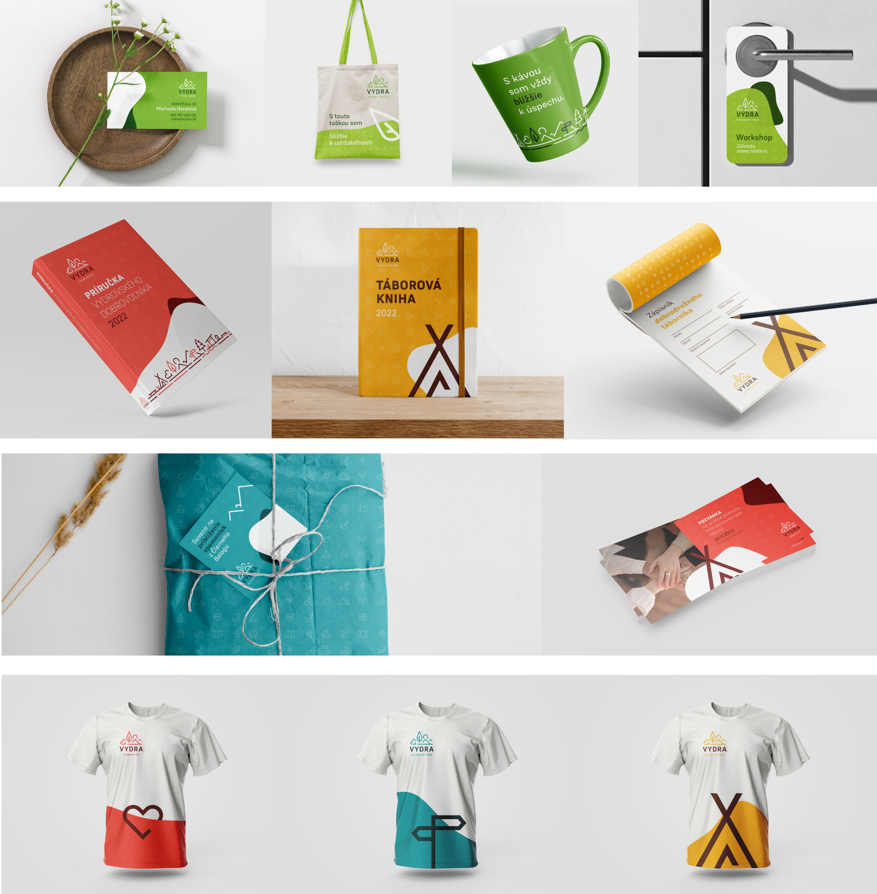

- [Summary](#thesis-summary)
- [Key words](#thesis-key-words)
- [Key points](#key-points)
- [Visuals](#visuals)

# Visual Identity of a Non-Profit Organization
---
## Thesis summary
The main goal of my thesis was to create a visual identity for Vydra, a non-profit organization (NFPO). With an emphasis to create a design that speaks for itself and a unique visual identity. The topic originated from my personal interest in visual identities and logo design alongside my personal knowledge of the values and ideas of the organization. My thesis also focuses on analyzing and researching other NFPOs and creating concepts of marketing and communication strategies.

## Thesis key words
- Graphic Design
- Non-Profit
- Visual Identity
- Branding
- Logo
- Marketing
- Communication
- Style
- Social Media
- Advertisement

## Key points
**About Vydra** 
In short, Vydra could be characterized as a non-profit organization with the aim of providing a wide range of services including organizing dirrefent cultural activities and adding overall value to the local and general public. Vydra functions as a non-profit organization and is volunteer-driven. It is the cooperation of these two parts of the organization that forms its essential basis. Vydra, since its origin in 1997, stands on a strong community basis.

**Topic choice:** 
I chose this topic because, when it comes to design, I have an inclination towards visual identities. Also, designing a visual identity provides for a wide range of creative opportunities. Choice of the subject was a simple process since I have been a volunteer of Vydra since 2015.

**Main goal:** 
The aim of my work was to create a functional and effective visual identity that meets the ideology and specific requirements of the organization and to describe the process that preceded the creation itself. I was hoping to create a unique visual identity that will proudly represent Vydra. The main real life inpact of my work will hopefully be a notable rise in brand visibility and an increase of public interest.

**Motivation:** 
The previous visual identity of Vydra was almost non-existent. I am personally interested in the wellbeing or the organization, thus I aimed to help both the community and Vydra itself.

## Visuals
The logo design posed as the essential basis of the whole visual identity. In my designs I divided Vydra into four main parts according to the different services that Vydra provides. The main logo consists of the name and an optional subtitle defining the region that they operate in. The second significant graphic element in the logo is the line illustration. The illustration visually describes the basic focus of the organization and the principles on which the Vydra community builds its image and internal ideology. The illustration is made up of simple elements and lines of uniform thickness and is arranged to form a centrally oriented composition.

The system of creating secondary logos is based primarily on the concept of replacing the subtitle with a specific name of the subcategory, changing the color and, last but not least, highlighting one or more parts of the illustration.

The main font used in the overall visual identity and logo is the Supreme font family. It is a sans-serif font with monolinear strokes designed by the Indian Type Foundry.

The visual identity uses iconography in three different use cases. One of them is the direct placement as a pictogram. The second form of application is the placement of icons as a background. The third use case for icons is placement as a free-standing visual accessory.

Coming to an end, I would like to showcase the visual identity in some real world use cases. These images represent the intended outcome of combining all the different elements of the visual identity into a final unified product.

