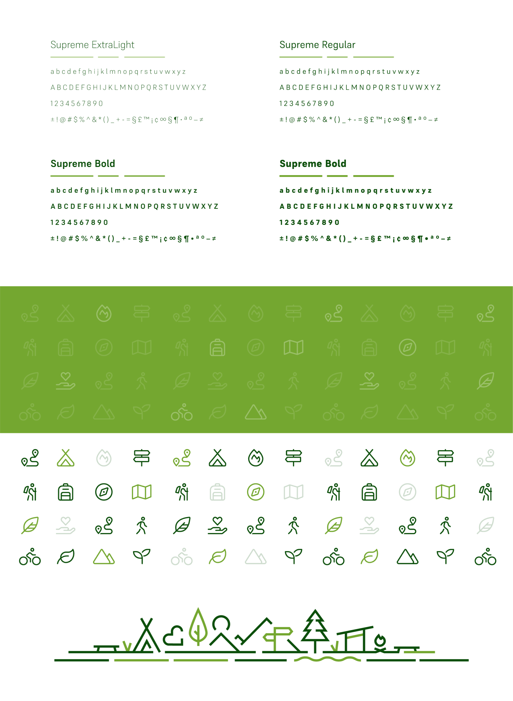

- [Summary](#thesis-summary)
- [Kewords](#thesis-keywords)
- [Insights](#insight-into-my-work)
- [Visuals](#visuals)

# Visual Identity of a Non-Profit Organization
---
## Thesis summary
The main goal of this thesis is to create a visual identity for Vydra, a non-profit organization (NFPO). With an emphasis to create a design that speaks for itself and a unique visual identity. The topic originates from personal interest in visual identities and logo design alongside the author's personal knowledge of the values and ideas of the organization. This thesis also focuses on analyzing and researching other NFPOs and creating concepts of marketing and communication strategies.

## Thesis keywords
- Graphic Design
- Non-Profit
- Visual Identity
- Branding
- Logo
- Marketing
- Communication
- Style
- Social Media
- Advertisement

## Insight into my work
**Topic choice:** 
I chose this topic because, when it comes to design, I have an inclination towards visual identities. Also, designing a visual identity provides for a wide range of creative opportunities. Choice of the subject was a simple process since I have been a volunteer of Vydra since 2015.

**Main goal:** 
The aim of my work was to create a functional and effective visual identity that meets the ideology and specific requirements of the organization and to describe the process that preceded the creation itself. I was hoping to create a unique visual identity that will proudly represent Vydra. The main real life inpact of my work will hopefully be a notable rise in brand visibility and an increase of public interest.

**Motivation:** 
The previous visual identity of Vydra was almost non-existent. I am personally interested in the wellbeing or the organization, thus I aimed to help both the community and Vydra itself.

## Visuals

