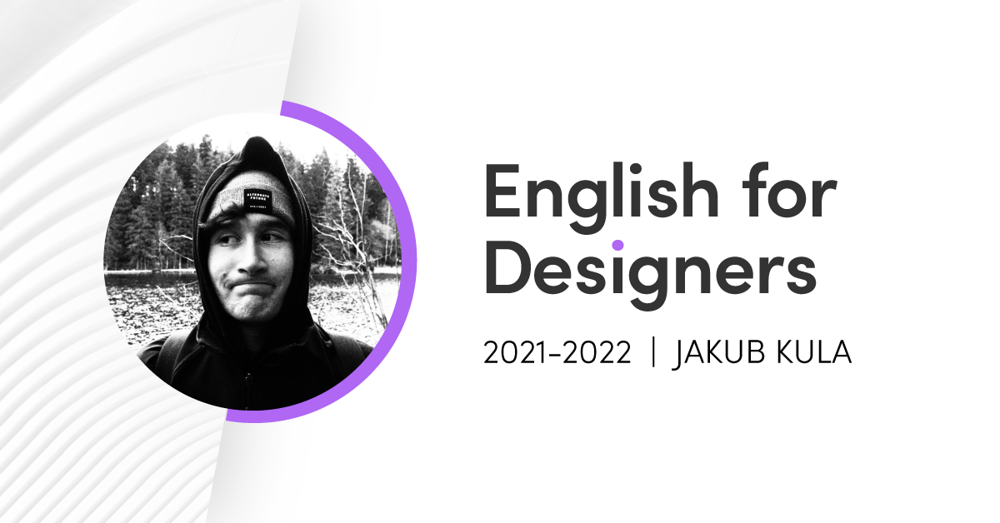

# Jakub Kula

---

## Get to know me:
Hi! I'm Jakub Kula and I see design as an important contribution to society. 
I’m a designer mainly focused on advertising and logo design.

Check out my [about page](03-aboutness/) to learn more.  
You can view the online version of my CV [here](04-experience/).

## Coursework overview:
#### [Composition](00-composition/) 
Initial coursework assignment. Instructions for a simple icebreaker. 
#### [Character & Description](01-character-description/)
Artwork presentation with the intention of writing good alternative text descriptions.
#### [Impression](02-impression/)
Choice of my best portfolio pieces for presentation.
#### [Aboutness](03-aboutness/)
Personal about page. My story as a designer and a short [case study](03-aboutness/case-study.md/).
#### [Experience](04-experience/)
My very own online CV.
#### [Voice & Tone](05-voice-tone/)
A summary of how I write and style texts.
#### [Storytelling](06-storytelling/)
Story of my (design) life.

---
#### [Clarity First](08-clarity-first/)
dddd
#### [Layout Second](09-layout-second/)
dddd
#### [Thesis Digest](10-thesis-digest/)
dddd
#### [Presentation](11-presentation/)
Final presentation.

---
#### [Year Review](year-review/)
Final presentation.

## 1st Semester Takeaways:
Here are a few things I learned this semester.
1. I was finally pushed to start using github in some way or another.
2. Content itself is more important than getting my spelling right.
3. I realized the importance of writing good, acessible and clear text.
4. Writing is hard. Even in my native language.

